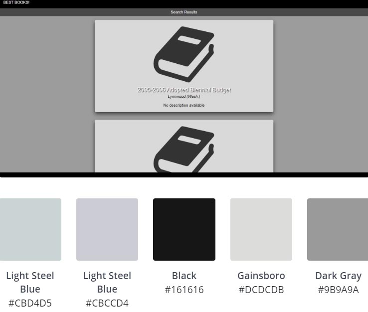

# Book-app project for Code Fellows 301-n15

**Authors**: Leo Kuhharau and Roman Sydoruk

**Version**: 1.0 Alpha

## Overview
The goal of this project is to build full stack app that would allow user to search Google Books API. 

## Getting Started
To get started go to https://lk-rs-booklist.herokuapp.com/  and follow the on screen instructions

## Architecture
This app has been develeoped using Javascript with the following dependencies, on the node.js framework:
  "cors": "^2.8.5",
  "dotenv": "^8.2.0",
  "ejs": "^2.7.4",
  "express": "^4.17.1",
  "superagent": "^5.1.0"

Color Palette: 

 

It has been deployed to: https://lk-rs-booklist.herokuapp.com/

## Change Log
11-20-2019 - App created, and initially styled. App can send a request to Google Books API and show a list of results

## Time Estimate

Number and name of feature: **Server setup**

Estimate of time needed to complete: 30 min

Start time: 4:30 PM

Finish time: 5:00 PM

Actual time needed to complete: 30 min

Number and name of feature: **Search Google Books API** 

Estimate of time needed to complete: 30 min

Start time: 5:00 PM

Finish time: 5:30 PM

Actual time needed to complete: 30 min

Number and name of feature: **Browse search results**

Estimate of time needed to complete: 1 hr

Start time: 6:30 PM

Finish time: 7:30 PM

Actual time needed to complete: 1 hr

Number and name of feature: **Logging errors**

Estimate of time needed to complete: 15 min

Start time: 7:30 PM

Finish time: 7:45 PM

Actual time needed to complete: 15 min

Number and name of feature: **Styling**

Estimate of time needed to complete: 2 hrs

Start time: 7:45 PM

Finish time: 9:15 PM

Actual time needed to complete: 1.5 hrs [*just initial styling]

## Credits and Collaborations
